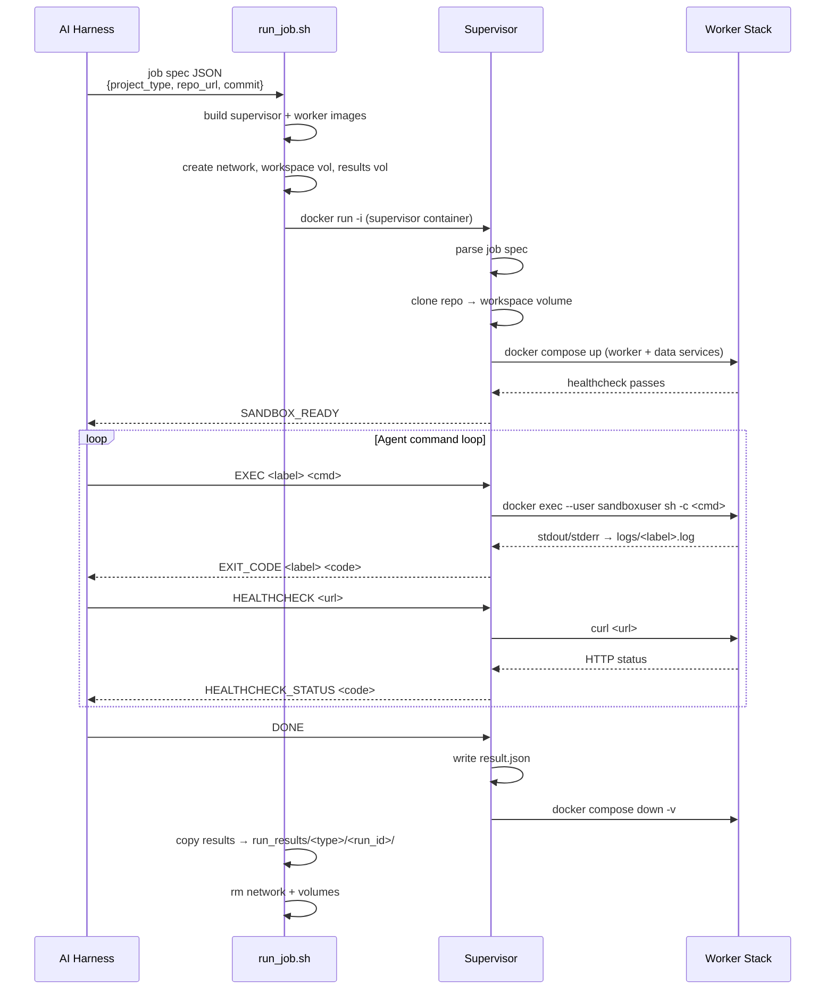
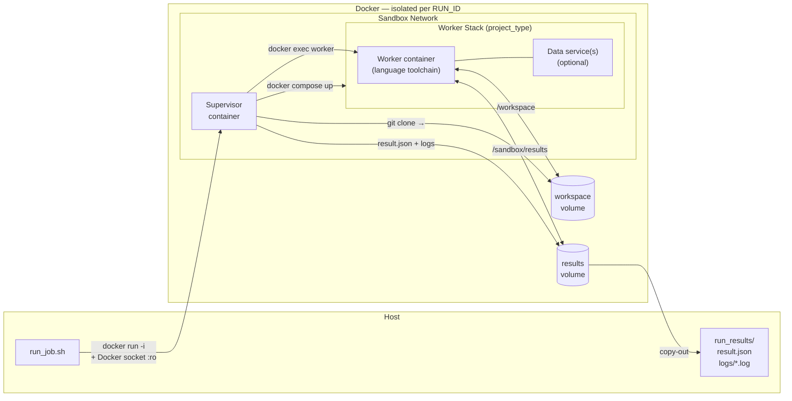

# Architecture

## Overview

AI agent sandbox: isolated Docker environment where an AI harness drives arbitrary build/test/run commands against a cloned repo. Supervisor is stack-agnostic; pluggable worker images handle language toolchains and data services.

---

## Job Lifecycle



---

## Container Topology (per run)



---

## Component Responsibilities

| Component | Responsibility |
|-----------|---------------|
| `run_job.sh` | Build images; create network + volumes; run supervisor; copy results out; teardown on exit |
| `supervisor/entrypoint.sh` | Parse job spec; clone repo; start stack; command loop (EXEC/HEALTHCHECK/DONE); write `result.json`; teardown |
| `lib/clone.sh` | `git clone` repo at specified commit into workspace volume |
| `lib/orchestrate.sh` | `docker compose up/down` for the project's stack; wait for worker healthcheck |
| `lib/exec.sh` | `docker exec --user sandboxuser` with per-step timeout; stream stdout+stderr to log file |
| `lib/capture.sh` | Write structured `result.json` with status, exit codes, per-step timing |
| `projects/<type>/worker/Dockerfile` | Language toolchain image (non-root `sandboxuser` UID 1001) |
| `projects/<type>/docker-compose.yml` | Worker + data services; external network + volumes |
| `projects/<type>/CLAUDE.md` | Agent guide: workflow steps, env vars, known issues — copied to `/workspace/AGENT_GUIDE.md` |

---

## Worker Stacks

| Stack | Worker | Data Services | Notes |
|-------|--------|---------------|-------|
| `nerv` | Node 20 Alpine | Redis 7 | `REDIS_URL=redis://redis:6379` |
| `medplum` | Node 22 Alpine | PostgreSQL 16 + Redis 7 | Turborepo monorepo; `seed-db` + `test-seed` steps required before `test` |
| `eshoponweb` | .NET SDK 10 | None | EF Core in-memory DB (`UseOnlyInMemoryDatabase=true`); Apple Silicon compatible |

---

## Security Model

- Supervisor mounts Docker socket read-only (`/var/run/docker.sock:ro`) — required to orchestrate worker containers.
- All worker commands run as `sandboxuser` (UID 1001, non-root).
- All containers: `no-new-privileges`, `cap_drop: ALL` (PostgreSQL drops only risky caps).
- Network is isolated per run; no shared network between runs.
- Workspace and results volumes are destroyed after each run.

---

## Result Output

```
run_results/<project_type>/<run_id>/
├── result.json          # status, exit codes, per-step timing
└── logs/
    ├── build.log
    ├── test.log
    ├── start-server.log
    ├── health-probe.log
    └── ...              # one log per EXEC label
```

`result.json` schema:

```json
{
  "run_id": "sandbox-<timestamp>",
  "status": "success | failure | timeout",
  "build_exit_code": 0,
  "test_exit_code": 0,
  "healthcheck_status": 200,
  "duration_seconds": 123,
  "steps": [
    { "label": "build", "status": "success", "exit_code": 0, "duration_seconds": 45 }
  ]
}
```
