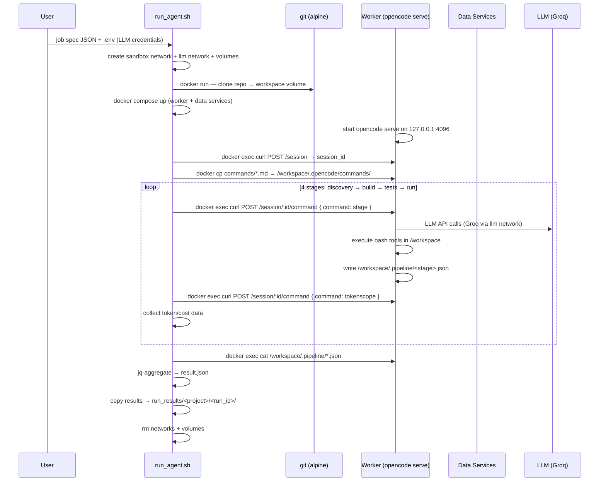
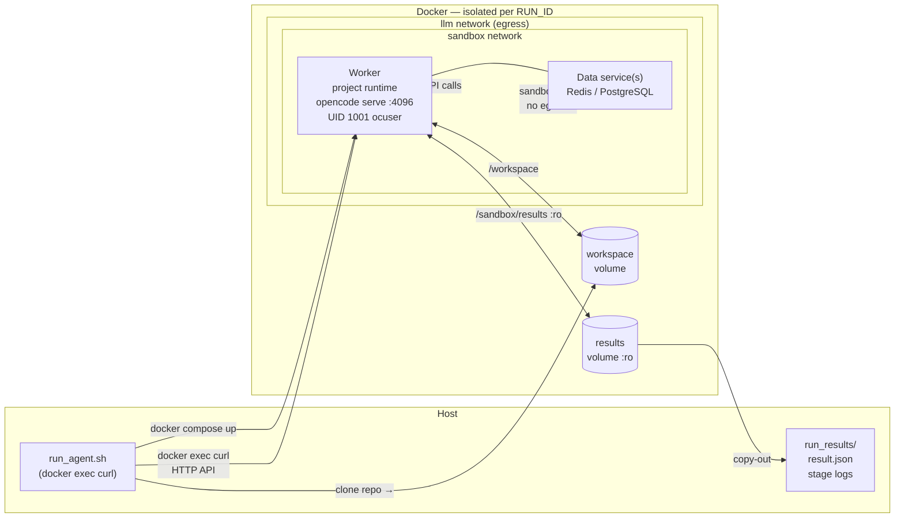

# Architecture

## Overview

AI agent sandbox: isolated Docker environment where an opencode LLM agent drives a multistage pipeline (discovery → build → tests → run+healthcheck) against a cloned repo. One container per run — **worker** (project runtime + opencode serve). `run_agent.sh` drives stages via HTTP API (`docker exec curl`). No agent container. No SSH.

---

## Job Lifecycle



---

## Container Topology (per run)



Note: data services join sandbox network only — no egress. Worker joins both networks (needs npm/pip registries + LLM API).

---

## Pipeline Stages

Each stage is an opencode custom command (`projects/<type>/commands/<stage>.md`) with `subtask: true` — isolated LLM context per stage. State passes via files in `/workspace/.pipeline/`.

| Stage | Command | Reads | Writes |
|-------|---------|-------|--------|
| discovery | `/discovery` | repo manifests | `discovery.json` — install/build/test/start cmds, health url, port |
| build | `/build` | `discovery.json` | `build.json` — status, exit_code, logs |
| tests | `/tests` | `discovery.json`, `build.json` | `tests.json` — passed, failed, logs |
| run | `/run` | `discovery.json` | `run.json` — status, response_code, logs |

Shell injection (`!cat /workspace/.pipeline/<stage>.json`) pulls prior stage output into each command prompt at invocation time.

---

## Component Responsibilities

| Component | Responsibility |
|-----------|---------------|
| `run_agent.sh` | Load `.env`; create networks + volumes; clone repo; start compose; wait for worker healthy; copy commands; create session; run 4-stage loop via HTTP API; aggregate results; teardown |
| `projects/<type>/worker/Dockerfile` | Project runtime + opencode binary + tokenscope plugin. Multi-stage build. Runs as root currently; non-root `ocuser` (UID 1001) planned in Stage 3 |
| `projects/<type>/worker/docker-entrypoint.sh` | exec `opencode serve --hostname 127.0.0.1 --port 4096` (API key from Docker secret planned Stage 3) |
| `projects/<type>/docker-compose.yml` | Worker + data services; declares external networks + volumes; no agent service |
| `projects/<type>/commands/*.md` | Per-stage opencode command files with frontmatter (`subtask: true`, `model`) and shell injection |
| `.example.env` / `.env` | LLM credentials: `LLM_MODEL`, `GROQ_API_KEY`, `LLM_BASE_URL` |
| `scripts/mock/llm_server.py` | OpenAI-compat mock LLM — returns canned responses for testing without real API calls |
| `scripts/test_pipeline.sh` | TDD test runner — runs pipeline with `MOCK=true`, asserts result.json shape |

---

## Worker Stacks

| Stack | Worker Runtime | Data Services | Notes |
|-------|---------------|---------------|-------|
| `nerv` | Node 20 + opencode | Redis 7 | `REDIS_URL=redis://redis:6379` |
| `medplum` | Node 22 + opencode | PostgreSQL 16 + Redis 7 | Turborepo monorepo; `--maxWorkers=2` for Jest |
| `eshoponweb` | .NET SDK 10 + opencode | None | EF Core in-memory DB; Apple Silicon compatible |

---

## Network Topology

| Network | Who joins | Purpose |
|---------|-----------|---------|
| `${RUN_ID}` (sandbox) | worker, data services | Inter-container communication |
| `${RUN_ID}-llm` (egress) | worker | Internet — npm/pip registries + LLM API |

Data services join sandbox only. Worker joins both.

---

## Security Model

| Concern | Implementation | Status |
|---------|---------------|--------|
| Docker socket | Not mounted on any container | ✅ |
| Code execution user | Runs as root currently; `ocuser` (UID 1001) planned Stage 3 | ⏳ |
| API key | Docker secret (tmpfile mount) planned Stage 3; currently via env var | ⏳ |
| Server auth | `OPENCODE_SERVER_PASSWORD` per run planned Stage 3; currently unsecured | ⏳ |
| opencode serve bind | `127.0.0.1` only — not reachable from other containers on same network | ✅ |
| Container hardening | `no-new-privileges` + `cap_drop: ALL` on all containers | ✅ |
| Resource limits | `mem_limit` + `cpus` on all containers | ✅ |
| Run timeout | `TIMEOUT_STAGE` (default 180s) polls for result.json | ✅ |
| Workspace permissions | `chmod 777 /workspace` — required because `cap_drop: ALL` removes `CAP_DAC_OVERRIDE` | ✅ |

---

## Mock / TDD Infrastructure

`MOCK=true ./scripts/run_agent.sh <job_spec>` — skips real repo clone, injects fixture workspace, points `LLM_BASE_URL` at local mock server.

| Component | Purpose |
|-----------|---------|
| `scripts/mock/llm_server.py` | OpenAI Responses API SSE mock (`POST /v1/responses` with `stream: true`). Logic: no tools → text response; tools + no tool result → bash function_call; tools + tool result → text "Done." |
| `scripts/mock/docker-compose.mock.yml` | mock-llm service on llm network; injected alongside worker stack. Uses `${MOCK_DIR}` absolute path (Docker Compose resolves relative paths in `-f` overlays relative to the first compose file) |
| `scripts/mock/workspace/` | Minimal fixture repo (package.json + stub) — no GitHub clone needed |

**opencode ≥ 1.17 uses OpenAI Responses API** (`/v1/responses`), not `/v1/chat/completions`. Always sends `stream: true` — mock must return `Content-Type: text/event-stream`. The `bash` tool arguments schema requires `{command, description}` — omitting `description` returns SchemaError.

---

## Result Output

```
run_results/<project_name>/<run_id>/
├── result.json
└── logs/
    ├── discovery.json
    ├── build.json
    ├── tests.json
    └── run.json
```

`result.json` — aggregated from stage JSONs by `run_agent.sh` via `jq`:

```json
{
  "status": "success | failure",
  "discovery": { "status": "...", "logs": "..." },
  "build":     { "status": "...", "exit_code": 0, "logs": "..." },
  "tests":     { "status": "...", "passed": 0, "failed": 0, "logs": "..." },
  "run":       { "status": "...", "response_code": 200, "logs": "..." },
  "errors":    [],
  "duration_seconds": 0,
  "stages": {
    "discovery": { "session_tokens": {}, "session_cost": 0.0 },
    "build":     { "session_tokens": {}, "session_cost": 0.0 },
    "tests":     { "session_tokens": {}, "session_cost": 0.0 },
    "run":       { "session_tokens": {}, "session_cost": 0.0 }
  },
  "total_cost": 0.0
}
```
