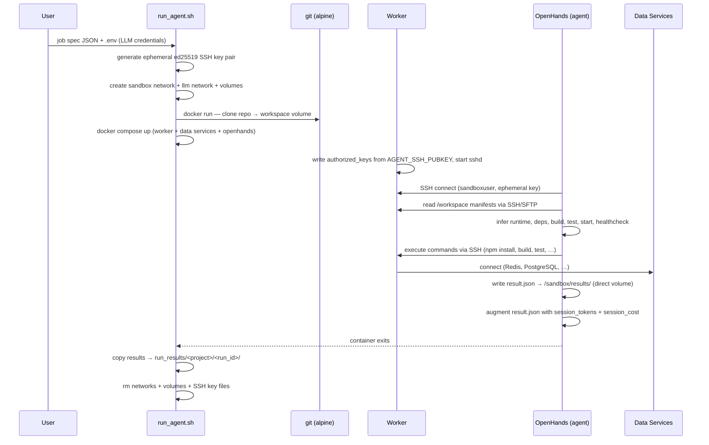
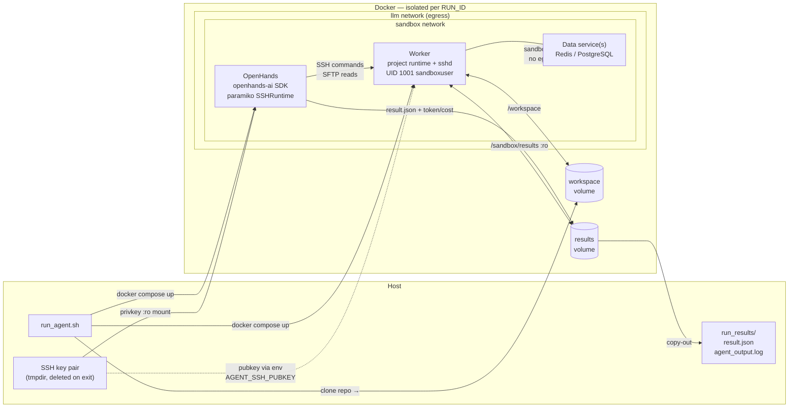

# Architecture

## Overview

AI agent sandbox: isolated Docker environment where an OpenHands LLM agent drives build/test/run commands against a cloned repo. Two containers per run — **worker** (project runtime + SSHd) and **openhands** (SDK agent). Agent SSHes into worker to execute all commands; no Docker socket on any container.

---

## Job Lifecycle



---

## Container Topology (per run)



Note: DS (data services) join sandbox network only — no llm network, no internet.  
Worker and OpenHands join both networks — need internet for package installs and LLM API calls.

---

## Component Responsibilities

| Component | Responsibility |
|-----------|---------------|
| `run_agent.sh` | Load `.env`; generate SSH key pair; create networks + volumes; clone repo; start compose; wait for OpenHands exit (timeout 1800s); copy results; teardown networks + volumes + keys |
| `scripts/openhands_runner.py` | Instantiate SSHRuntime (paramiko → worker); run OpenHands controller; capture `state.metrics`; augment `result.json` with `session_tokens` + `session_cost` |
| `docker/Dockerfile.agent` | Shared agent image — `python:3.11.9-slim` + `openhands-ai` + `paramiko`. Project-agnostic; all project types use same `ai-sandbox-agent` image |
| `projects/<type>/worker/Dockerfile` | Project runtime image + `openssh-server`. Built per project type (`ai-sandbox-<type>-worker`) |
| `projects/<type>/worker/docker-entrypoint.sh` | Write `authorized_keys` from `AGENT_SSH_PUBKEY` env; exec `sshd -D` |
| `projects/<type>/docker-compose.yml` | Worker + data services + openhands; declares external networks + volumes |
| `projects/<type>/prompt.txt` | Per-project task prompt; injected as `TASK` env var into OpenHands |
| `.example.env` / `.env` | LLM credentials: `LLM_MODEL`, `GROQ_API_KEY`, `LLM_BASE_URL` |

---

## Worker Stacks

| Stack | Worker Runtime | Data Services | Notes |
|-------|---------------|---------------|-------|
| `nerv` | Node 20 + SSHd | Redis 7 | `REDIS_URL=redis://redis:6379` |
| `medplum` | Node 22 + SSHd | PostgreSQL 16 + Redis 7 | Turborepo monorepo |
| `eshoponweb` | .NET SDK 10 + SSHd | None | EF Core in-memory DB; Apple Silicon compatible |

All stacks use shared `ai-sandbox-agent` image for the openhands service.

---

## Network Topology

Two Docker networks created per run, both destroyed in cleanup:

| Network | External? | Who joins | Purpose |
|---------|-----------|-----------|---------|
| `${RUN_ID}` (sandbox) | No | worker, openhands, data services | Inter-container communication |
| `${RUN_ID}-llm` (egress) | Yes | worker, openhands | Internet access — npm/pip registries + LLM API |

Data services (Redis, PostgreSQL) join sandbox only — no outbound internet needed.

---

## Security Model

| Concern | Implementation |
|---------|---------------|
| Docker socket | Not mounted on any container — eliminates host escape vector |
| Code execution user | `sandboxuser` (UID 1001, non-root) — SSH target in worker |
| SSH keys | Ephemeral ed25519 key pair generated per run; deleted in cleanup trap |
| Container hardening | `no-new-privileges` + `cap_drop: ALL` on all containers |
| Resource limits | `mem_limit` + `cpus` on all containers |
| Run timeout | `TIMEOUT_TOTAL` (default 1800s) wraps `docker wait` |
| Results integrity | Worker mounts results volume `:ro`; OpenHands writes `result.json` via direct volume mount |

---

## Result Output

```
run_results/<project_name>/<run_id>/
├── result.json
└── agent_output.log
```

`project_name` = last segment of `repo_url` (`.git` stripped).

`result.json` — written by OpenHands agent per prompt instructions, augmented by `openhands_runner.py`:

```json
{
  "status": "success | failure",
  "build":        { "status": "...", "command": "...", "exit_code": 0,   "logs": "..." },
  "start_server": { "status": "...", "command": "...",                    "logs": "..." },
  "tests":        { "status": "...", "command": "...", "passed": 0, "failed": 0, "logs": "..." },
  "health_check": { "status": "...", "url": "...", "response_code": 200, "logs": "..." },
  "errors":       [],
  "duration_seconds": 0,
  "session_tokens": {
    "prompt_tokens": 0,
    "completion_tokens": 0,
    "cache_read_tokens": 0,
    "cache_write_tokens": 0
  },
  "session_cost": 0.0
}
```
