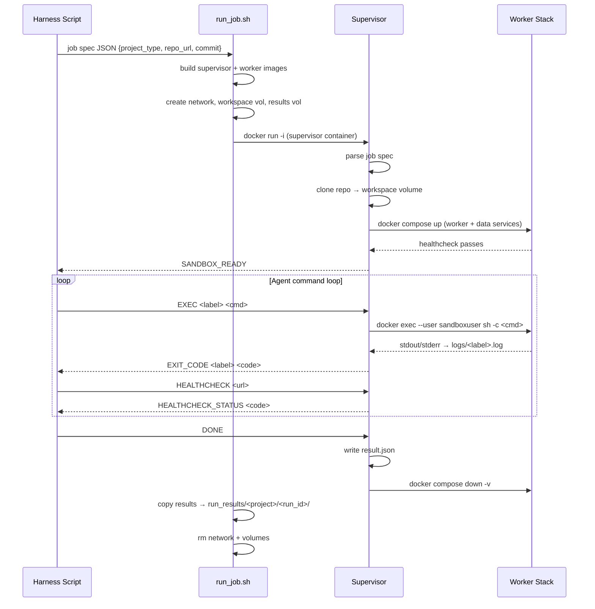
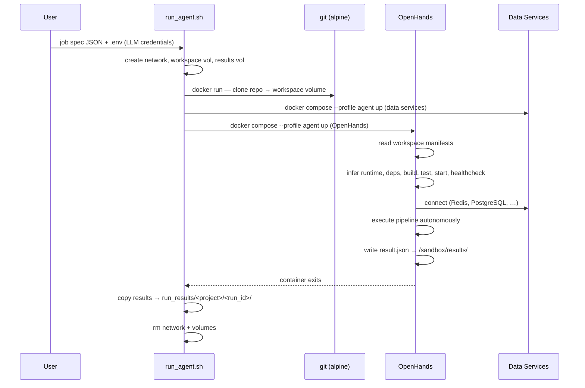
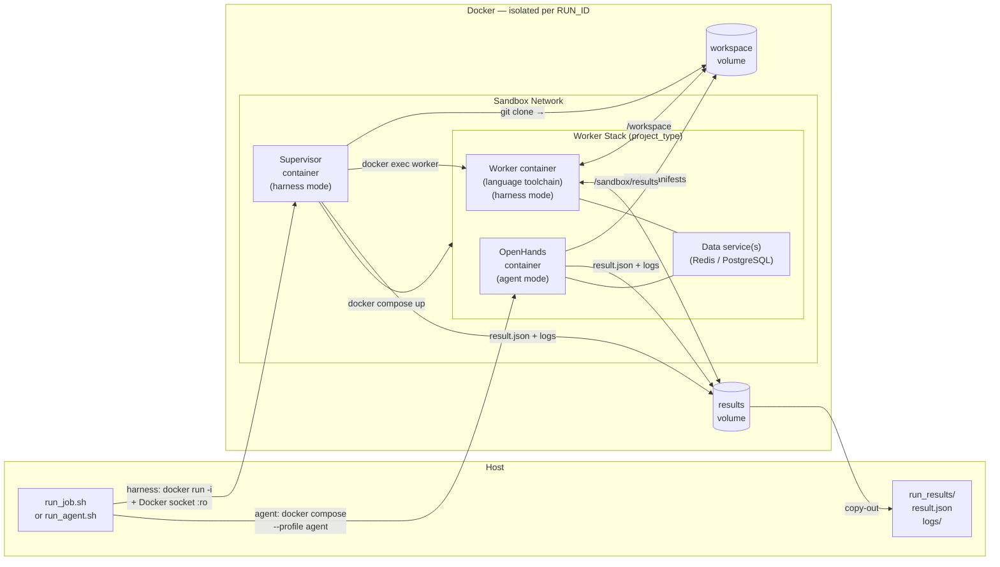

# Architecture

## Overview

AI agent sandbox: isolated Docker environment where an agent drives build/test/run commands against a cloned repo. Two runner modes — **harness** (scripted EXEC protocol) and **agent** (OpenHands LLM, autonomous). Supervisor and worker stacks are pluggable; OpenHands replaces the scripted harness for unknown repos.

---

## Harness Mode — Job Lifecycle



---

## Agent Mode — Job Lifecycle



---

## Container Topology (per run)



---

## Component Responsibilities

| Component | Mode | Responsibility |
|-----------|------|---------------|
| `run_job.sh` | harness | Build images; create network + volumes; run supervisor; copy results; teardown |
| `run_agent.sh` | agent | Load `.env`; clone repo; start compose `--profile agent`; wait for OpenHands exit; copy results; teardown |
| `supervisor/entrypoint.sh` | harness | Parse job spec; clone repo; start stack; EXEC/HEALTHCHECK/DONE loop; write `result.json`; teardown |
| `lib/clone.sh` | harness | `git clone` repo at commit into workspace volume |
| `lib/orchestrate.sh` | harness | `docker compose up/down`; wait for worker healthcheck |
| `lib/exec.sh` | harness | `docker exec --user sandboxuser` with per-step timeout; stream to log |
| `lib/capture.sh` | harness | Write structured `result.json` |
| `projects/<type>/worker/Dockerfile` | harness | Language toolchain image (non-root `sandboxuser` UID 1001) |
| `projects/<type>/docker-compose.yml` | both | Worker + data services (default); OpenHands service (`profiles: [agent]`) |
| `agent/prompts/pipeline_task.txt` | agent | Task prompt; injected as `TASK` env var into OpenHands command |
| `.example.env` / `.env` | agent | LLM credentials: `LLM_MODEL`, `GROQ_API_KEY`, `LLM_BASE_URL` |

---

## Worker Stacks

| Stack | Worker | Data Services | Notes |
|-------|--------|---------------|-------|
| `nerv` | Node 20 Alpine | Redis 7 | `REDIS_URL=redis://redis:6379` |
| `medplum` | Node 22 Alpine | PostgreSQL 16 + Redis 7 | Turborepo monorepo |
| `eshoponweb` | .NET SDK 10 | None | EF Core in-memory DB; Apple Silicon compatible |

All stacks include an `openhands` service behind `profiles: [agent]` — started only by `run_agent.sh`.

---

## Security Model

| Concern | Harness mode | Agent mode |
|---------|-------------|------------|
| Docker socket | Supervisor: read-only mount (required to manage worker stack) | Not mounted — OpenHands uses local runtime |
| Code execution user | `sandboxuser` (UID 1001, non-root) via `docker exec` | OpenHands internal user (no sandboxuser enforcement) |
| Container hardening | `no-new-privileges`, `cap_drop: ALL` on worker + data services | Standard OpenHands image defaults |
| Network isolation | Dedicated bridge network per run | Same — dedicated bridge network per run |
| Filesystem access | Worker: workspace + results volumes only | OpenHands: workspace + results volumes only |

---

## Result Output

```
run_results/<project_name>/<run_id>/
├── result.json
├── supervisor.log        # harness mode
├── agent_output.log      # agent mode (OpenHands --json stream)
└── logs/
    ├── build.log
    ├── test.log
    └── ...
```

`project_name` = last segment of `repo_url` (`.git` stripped).

**Harness mode** `result.json`:

```json
{
  "run_id": "sandbox-<timestamp>",
  "status": "success | failure | timeout",
  "build_exit_code": 0,
  "test_exit_code": 0,
  "healthcheck_status": 200,
  "duration_seconds": 123,
  "steps": [
    { "label": "build", "status": "success", "exit_code": 0, "duration_seconds": 45 }
  ]
}
```

**Agent mode** `result.json` (written by OpenHands per prompt instructions):

```json
{
  "status": "success | failure",
  "build":        { "status": "...", "command": "...", "exit_code": 0,   "logs": "..." },
  "start_server": { "status": "...", "command": "...",                    "logs": "..." },
  "tests":        { "status": "...", "command": "...", "passed": 0, "failed": 0, "logs": "..." },
  "health_check": { "status": "...", "url": "...", "response_code": 200, "logs": "..." },
  "errors":       [],
  "duration_seconds": 0
}
```
